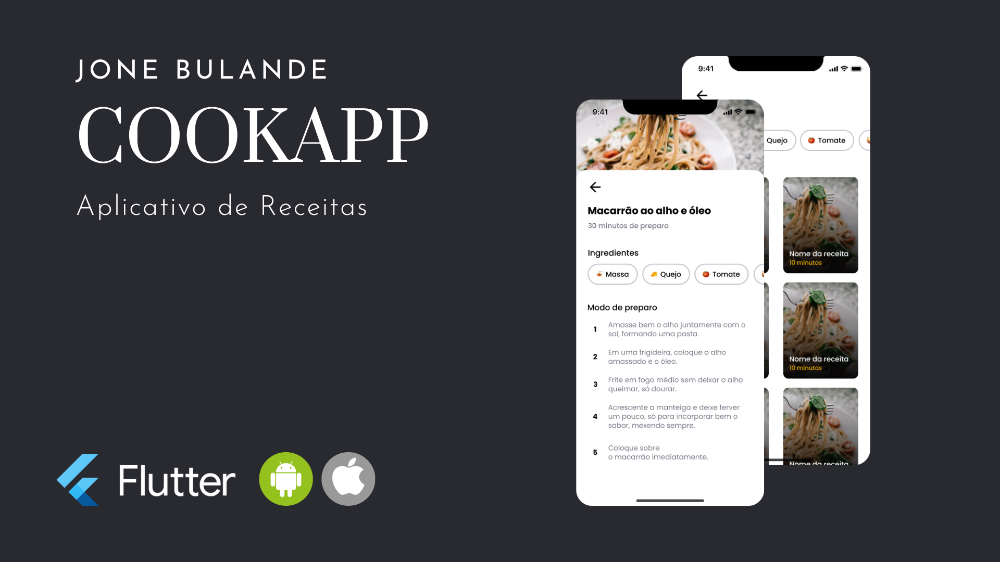

# 🍎 cookapp — App de Receitas em Flutter

<p align="center">
  
</p>

**cookapp** é um app mobile de receitas onde o utilizador seleciona os ingredientes que tem em casa e descobre receitas que pode preparar com eles.

---

## ✨ Funcionalidades

- Seleção de ingredientes por chips interativos
- Filtro de receitas baseado nos ingredientes escolhidos
- Grid de receitas com imagem, nome e tempo de preparo
- Detalhe da receita com lista de ingredientes e modo de preparo
- Animações e microinterações nativas

---

## 🚀 Tecnologias

- **Flutter** + **Dart**
- **google_fonts** — tipografia DM Sans
- Material Design 3

---

## 🔧 Como executar

```bash
git clone https://github.com/JoneBulande/cookapp.git
cd cookapp
flutter pub get
flutter run
```

---

## 🎨 Design

O design original deste app foi criado pela **[Rocketseat](https://rocketseat.com.br)** e desenvolvido em **React Native**.  
Como desafio pessoal, decidi recriar o app completamente do zero em **Flutter**, sem seguir nenhum tutorial ou código de base — apenas o design como referência.

---

## 👨‍💻 Autor

Feito com 💚 por [Jone Bulande](https://github.com/JoneBulande)
